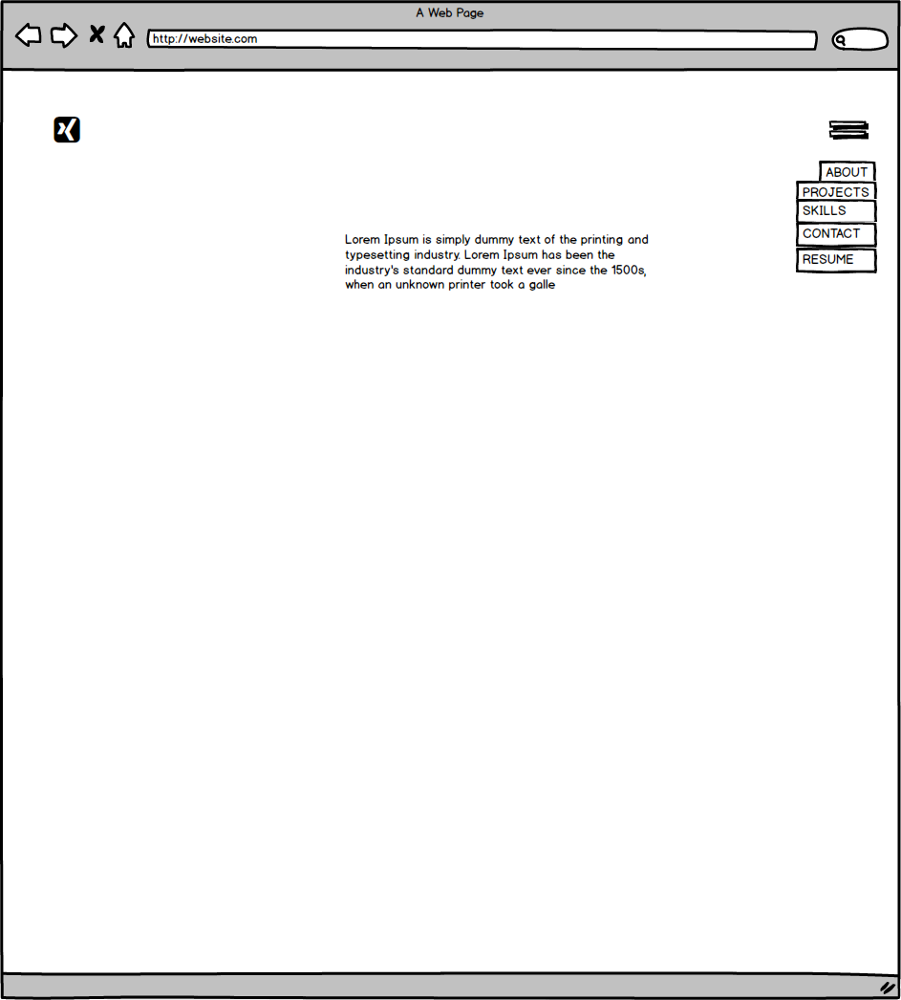
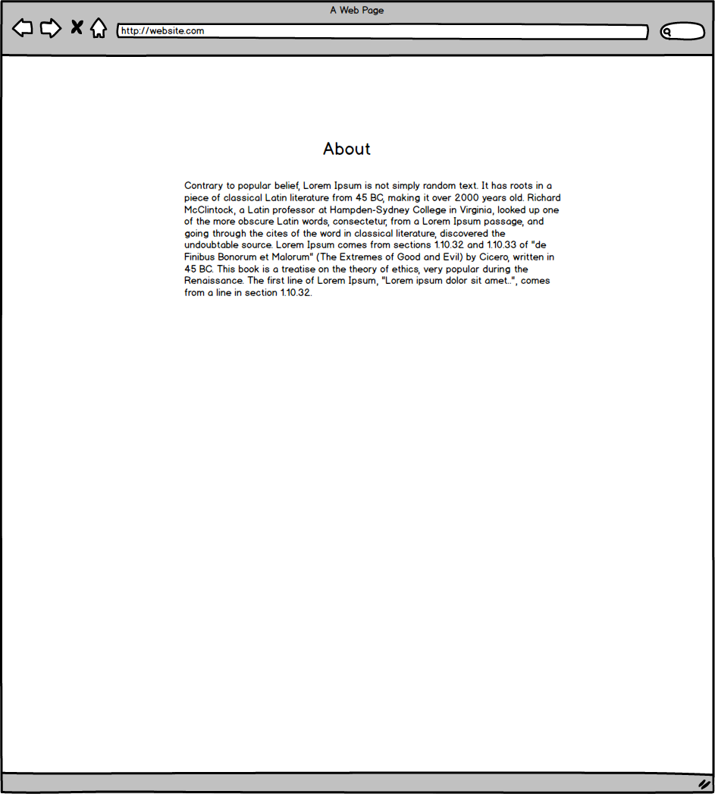
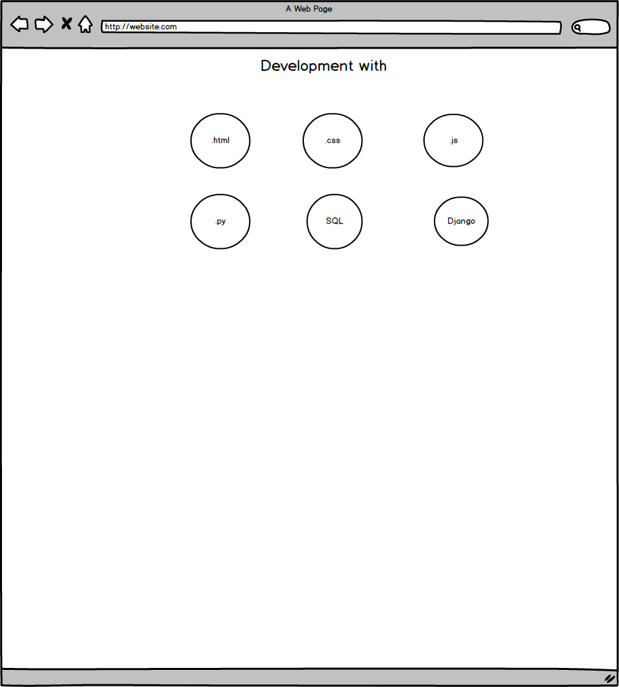
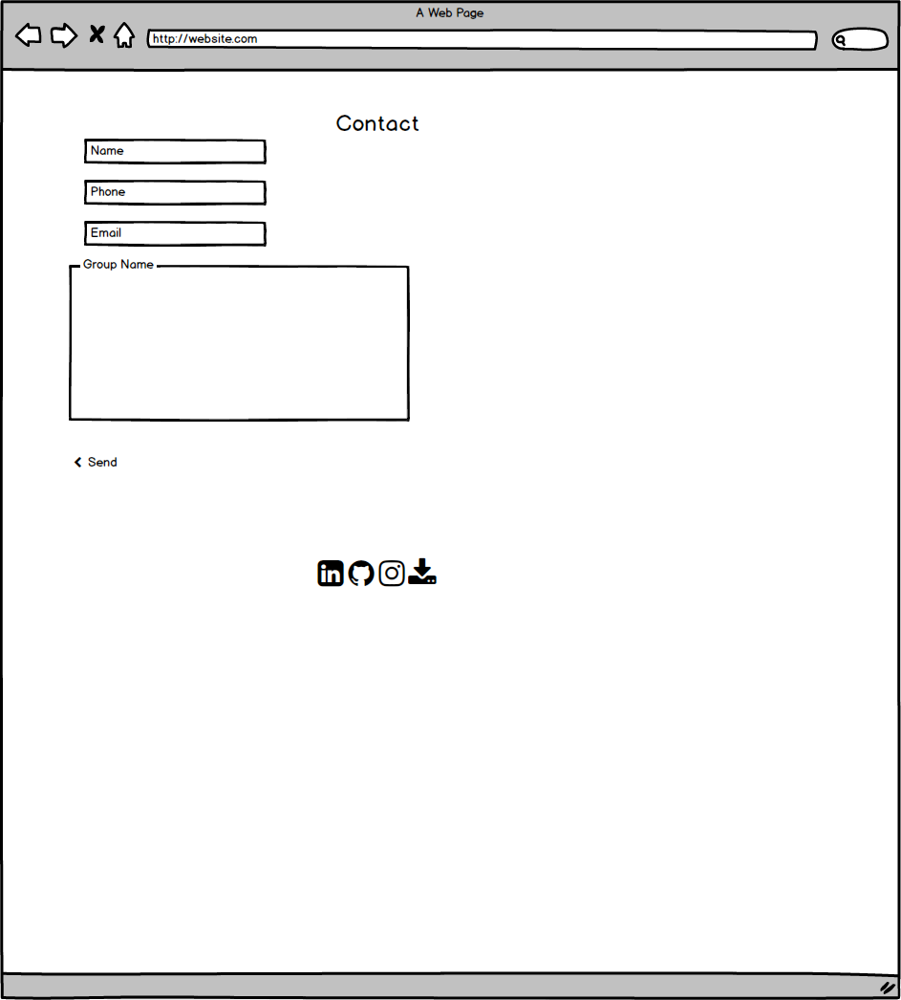

# Mile-1

Milestone One Project

The aim of this project is to satisfy Code Institute requirements as well as to represent my future business as a software provider. It is my very first project, hence, there is a lot more to be desired and tweaked before there is a final push and call out to customers. 
I believe, I have created mobile first approach web site using HTM and CSS, the modules I got familiar with so far. Bootstrap, has been used to a big extend as well. Back-end functionality is not available for that project, so, from the links, only “learn more” will work, providing external window loading my Resume.
I am a junior accountant, and even though, having limited to work on the project, I have big ideas on how this will grow in the future!

UX

I have focused primarily on simplicity, emphasizing on the landing page with the logo and moto of my future brand. It look just way I wanted to look.

Current Features

•	About Me – you can find more about my background

•	Projects- you can see the future web-sites that I will do for friends 

•	Contact – A contact form which has not been linked to anything

Future Features

•	Improving the brand portfolio 

Technologies

•	HTML-HTML5

•	CSS – has been used for styling purposes

•	VSCode – is text editor that I am currently using

•	Bootstrap – has been used big time to create the desired framework of my web-site

•	Git & Github – for storing and backing up externally 

•	Javascript/JQuery – This has enabled the drop down on the nav bar working properly

Testing and Debugging 

•	For these I have used DevTools in Google. Great feature that enables you making changes without actually changing the code

•	Also, give you the opportunity to switch between different mobile versions seeing how the project would look like 

Credits

•	Special shout outs to my mentor Reuben Ferrante, great guy, would not make it without him scheduling meeting outside his calendar and giving way more than 30 min per session are only a small portion of what this man has done for me

•	Balsamiq – has been used to create the wireframe for the project

•	W3Schools – I used for the icons embedded in the drop down

•	Finally, I want to thank Code Institute for having me in that great program 

